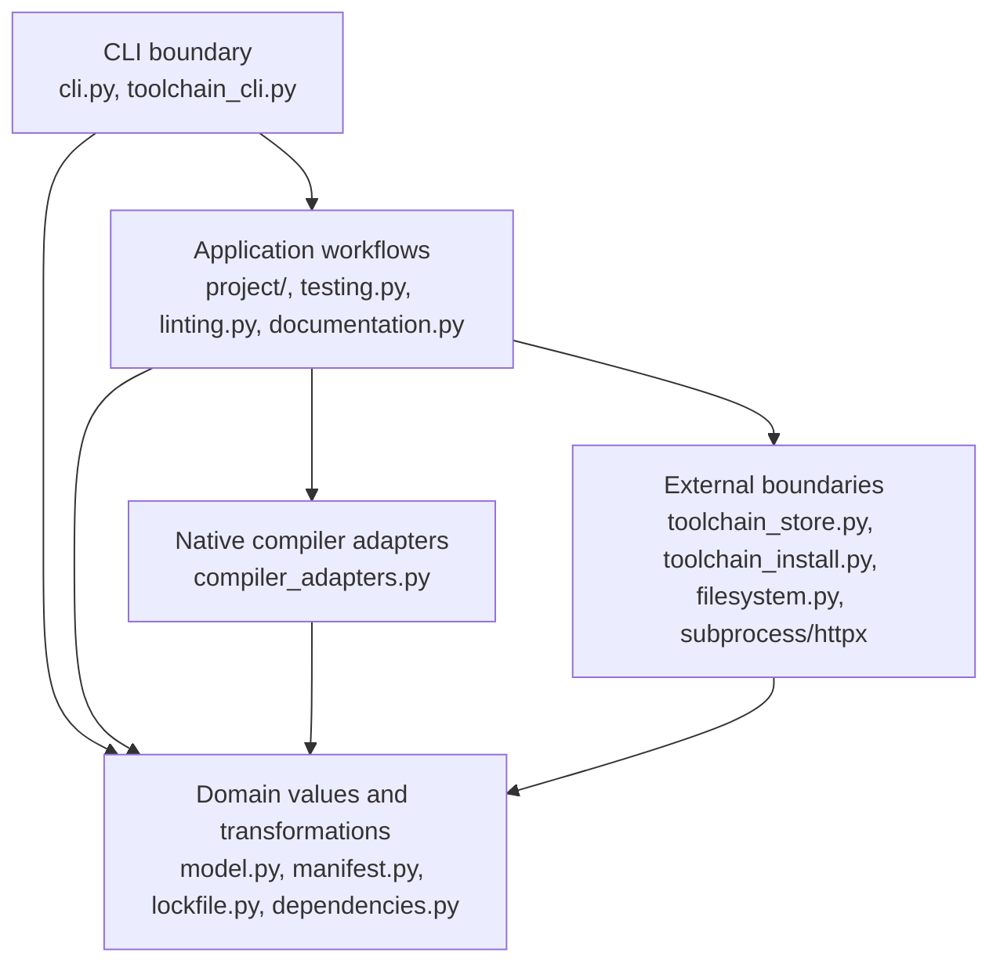
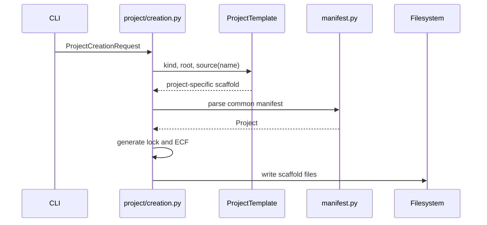
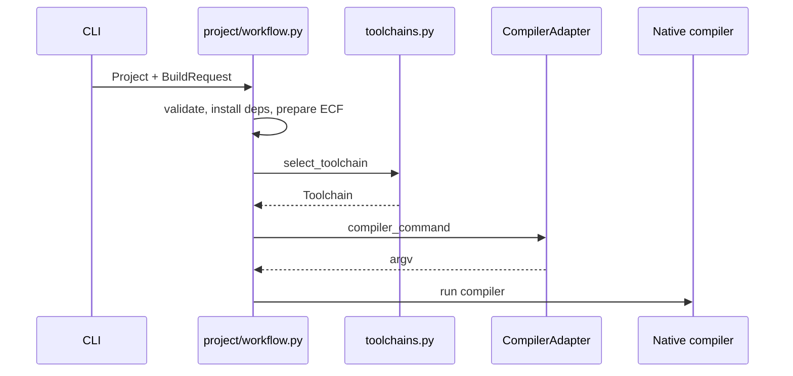

# Архитектура EVM

Этот документ объясняет устройство кода EVM: основные понятия, границы
модулей и направления зависимостей. Пользовательское поведение, форматы файлов
и нормативные требования определяет [`SPEC.md`](SPEC.md). При расхождении
документов источником истины является спецификация.

## Цели архитектуры

Архитектура должна помогать разработчику быстро ответить на три вопроса:

1. В каком модуле находится нужное правило?
2. Какая часть кода может выполнять ввод-вывод?
3. Где реализуется различие между Eiffel-компиляторами?

EVM использует Python как мультипарадигмальный язык. Неизменяемые структуры
данных описываются dataclass-моделями, чистые преобразования — функциями,
взаимозаменяемое поведение — небольшими объектами и `Protocol`. Класс вводится
не ради единообразия, а когда у сущности есть идентичность, состояние,
инварианты или несколько реализаций.

## Общая схема

Верхний слой может зависеть от нижнего. Доменная модель не должна импортировать
Click или знать, как сообщение будет показано пользователю.

## Базовые понятия

### Project

`Project` — нормализованное, неизменяемое представление одного Eiffel-пакета.
Оно создаётся парсером `Eiffel.toml` и передаётся в workflows. Объект проекта
не читает и не записывает себя самостоятельно: загрузка, преобразование и
транзакционная запись остаются явными операциями.

Связанные модули:

- `model.py` — значения доменной модели;
- `manifest.py` — разбор и проверка `Eiffel.toml`;
- `project/creation.py` — создание каркаса нового проекта;
- `project/templates.py` — вариативные части application и library;
- `project/workflow.py` — подготовка, сборка, запуск и импорт проекта;
- `workspace.py` — выбор пакетов и порядок работы с workspace.

### Project template

`ProjectTemplate` описывает только те части нового проекта, которые зависят от
его типа: значение `project.type`, корневой класс и начальный исходный файл.
`ApplicationProjectTemplate` и `LibraryProjectTemplate` являются встроенными
реализациями этого протокола.

Шаблон не создаёт каталоги, не записывает файлы и не формирует lock или ECF.
`project/creation.py` принимает `ProjectCreationRequest`, комбинирует выбранный
шаблон с общей структурой проекта и выполняет файловые операции. Благодаря
этому правила общего каркаса имеют одно представление, а новый тип проекта не
добавляет selector-флаги в workflow.

### Toolchain selector

`ToolchainSelector` — пользовательское требование вида `gobo`, `gobo@26.06`
или `ise@nightly`. Selector не означает, что соответствующий компилятор уже
установлен.

### Toolchain artifact

`ToolchainArtifact` описывает конкретный скачиваемый дистрибутив для одной
платформы: provider, версию, revision, URL и ожидаемую контрольную сумму.
Каталог релизов создаёт artifacts, но не устанавливает их.

### Toolchain installation

`ToolchainInstallation` описывает доступный на машине дистрибутив. Managed
installation принадлежит EVM; linked installation только зарегистрирован и не
должен удаляться с диска при снятии регистрации.

`toolchain_store.py` отвечает за хранение регистраций, выбор installation и
формирование окружения. `toolchain_install.py` отвечает за каталог релизов,
загрузку, проверку и безопасную распаковку.

### Selected toolchain

`toolchains.Toolchain` — компилятор, уже выбранный для одной операции над
проектом. Он содержит executable, обнаруженную версию и объяснение выбора. Это
не менеджер установок и не каталог релизов. Название сохранено ради
совместимости текущего API; при следующем изменении публичной модели его можно
уточнить до `SelectedCompiler`.

### Compiler adapter

`CompilerAdapter` переводит общий `BuildRequest` в детали конкретного
компилятора. Сейчас существуют `IseCompilerAdapter` и `GoboCompilerAdapter`.
Они отвечают только за различия:

- native compiler command;
- расположение результирующих artifacts;
- переменные для legacy ECF;
- compiler-specific проверку capabilities.

Адаптер не выбирает и не устанавливает компилятор, не изменяет manifest и не
запускает subprocess. Благодаря этому построение команды остаётся отдельно
тестируемым преобразованием без файловых side effects.

### Workflow backend

Lint, documentation и test не являются обязательными методами compiler
adapter. Например, ISE-проект может использовать утилиту Gobo `gelint`, а
тесты могут запускаться через autotest, getest или собранный test target.
Поэтому `linting.py`, `documentation.py` и `testing.py` выбирают backend на
уровне workflow. Если число реализаций продолжит расти, для них следует ввести
узкие протоколы `LintBackend`, `DocumentationBackend` и `TestRunner`, а не
расширять `CompilerAdapter`.

## Основные потоки

### New и init

CLI выбирает конкретный встроенный шаблон. Протокол не знает о Click options,
а `Project` не знает, каким шаблоном он был создан.

### Build и check

`check_only` меняет native режим компилятора, но использует тот же путь выбора
toolchain и подготовки проекта.

### Run

`run_project` сначала выполняет обычную сборку. Затем compiler adapter сообщает
возможные пути результата, workflow выбирает существующий executable и запускает
его с пользовательскими аргументами. CLI не знает структуру `EIFGENs` или
правила имён Gobo artifacts.

### Toolchain install

1. CLI преобразует строку в `ToolchainSelector`.
2. Каталог разрешает selector в `ToolchainArtifact`.
3. Installer использует локальный cache либо загружает архив.
4. Контрольная сумма и имена элементов архива проверяются до установки.
5. Распаковка происходит во временный каталог.
6. Готовая installation атомарно регистрируется в store.

Эта последовательность является транзакционной границей. Не следует переносить
её в compiler adapter или модель `ToolchainInstallation`.

### Toolchain use

`configure_project_toolchains` изменяет проектную политику: разрешает selectors,
обновляет `Eiffel.toml` и согласованно записывает `Eiffel.lock`. Это операция над
проектом, а не поведение конкретного компилятора, поэтому она остаётся общей
для всех providers.

## Границы CLI

CLI-модули выполняют только четыре задачи:

1. объявляют Click arguments и options;
2. преобразуют их в типизированный request;
3. вызывают workflow;
4. отображают результат.

`cli.py` содержит проектные команды, а `toolchain_cli.py` — группу
`evm toolchain`. Общий декоратор `command_errors` находится в `cli_support.py`.
Domain errors представлены `EvmError`; только CLI boundary преобразует их в
`ClickException` или стабильный JSON.

Если обработчик команды начинает содержать правила разрешения зависимостей,
построения compiler command или изменения manifest, правило следует перенести
в соответствующий application/domain-модуль.

## Как добавить новый компилятор

Минимальный встроенный компилятор добавляется явно, без динамического plugin
framework:

1. Добавить стабильное code name в разбор `ToolchainSelector`.
2. Реализовать `CompilerAdapter` и зарегистрировать его в
   `compiler_adapters.py`.
3. Реализовать каталог artifacts в `toolchain_install.py` либо переиспользовать
   существующий формат каталога.
4. Научить store находить executable и формировать обязательное окружение.
5. Добавить compatibility/capability rules.
6. Добавить contract tests для command, artifacts, selection, installation и
   ошибочных границ.

Реестр намеренно является обычным словарём. Автоматическая регистрация
подклассов и entry points не нужны, пока EVM не поддерживает внешние плагины как
продуктовую возможность.

## Как добавить новый тип проекта

Новый встроенный тип каркаса добавляется без изменения общего workflow:

1. Реализовать узкий `ProjectTemplate` в `project/templates.py`.
2. Указать стабильный `kind`, корневой класс при его наличии и начальный
   исходный файл.
3. Добавить явный выбор реализации на CLI boundary.
4. Добавить contract tests шаблона и интеграционный тест созданного проекта.

Реализация не должна самостоятельно формировать общий manifest, писать файлы
или создавать доменный `Project`. Если новому типу нужна дополнительная общая
настройка, сначала следует проверить, является ли она частью протокола или
отдельной ортогональной опцией `ProjectCreationRequest`.

## Правила изменения кода

- Правило продукта имеет одно авторитетное представление; требования не
  копируются из `SPEC.md` в docstrings.
- Парсинг, нормализация, сравнение версий и построение графов по возможности
  остаются чистыми функциями.
- Сетевой доступ, subprocess и запись файлов находятся на явных границах.
- Новые production-функции и методы имеют type annotations.
- Docstring объясняет роль публичной сущности и её границы, а не повторяет
  реализацию построчно.
- Новая абстракция вводится для существующей вариативности или инварианта, а не
  для предполагаемого будущего использования.
- Изменение поведения сопровождается тестом. Полный критерий готовности —
  успешный `make ci`.

## Карта модулей

| Область | Основные модули |
| --- | --- |
| CLI boundary | `cli.py`, `toolchain_cli.py`, `cli_support.py` |
| Project creation | `project/creation.py`, `project/templates.py` |
| Project workflows | `project/workflow.py`, `testing.py`, `linting.py`, `documentation.py` |
| Compiler variability | `compiler_adapters.py`, `toolchains.py` |
| Toolchain lifecycle | `toolchain_types.py`, `toolchain_install.py`, `toolchain_store.py`, `toolchain_commands.py` |
| Manifest and domain model | `manifest.py`, `model.py`, `versioning.py` |
| Dependency lifecycle | `dependencies.py`, `dependency_commands.py`, `lockfile.py` |
| ECF boundary | `ecf.py` |
| Filesystem boundary | `filesystem.py` |

Эта карта описывает текущий код. При появлении нового устойчивого направления
ответственности документ должен обновляться вместе с рефакторингом.
